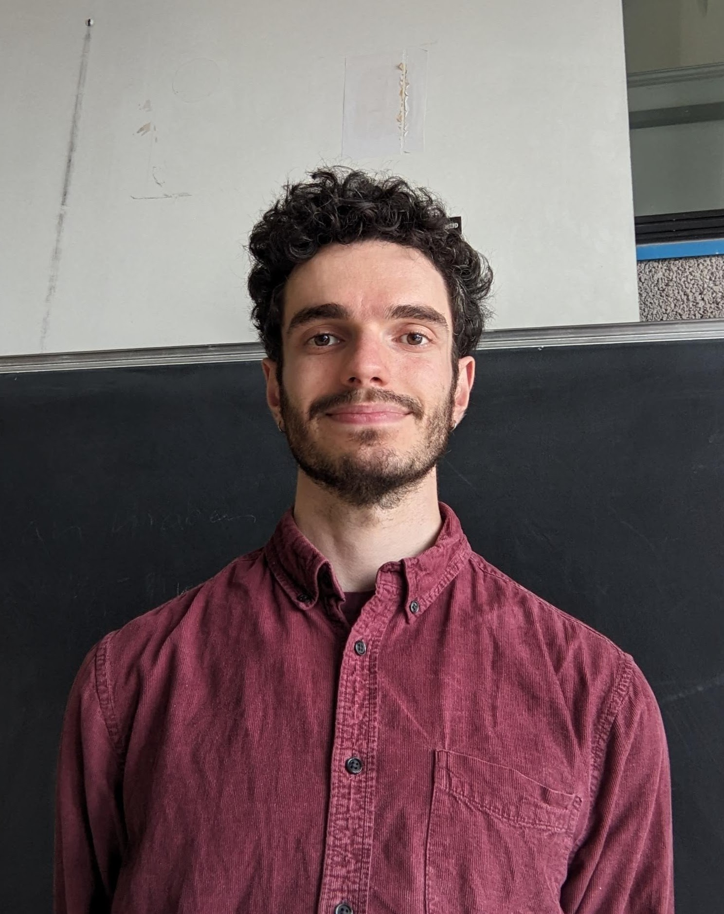

  

email: nowell at tu-berlin dot de 

address: Room E217, Str. des 17. Juni 136, Berlin 10587

# About 
I am a PhD student at TU Berlin, working under the joint supervision of [Carlos Améndola](https://luke-amendola.appspot.com/) and [Ben Hollering](https://sites.google.com/view/benhollering) as part of the ["Combinatorial Methods for Learning Max-Linear Bayesian Networks"](https://www.combinatorial-synergies.de/projects/?elem=Combinatorial-Methods-for-Learning-Max-Linear-Bayesian-Networks) project of the "Combinatorial Synergies" DFG priority programme (SPP 2458). 

I obtained my master's degree in mathematics in 2024, also at TU Berlin. I wrote my thesis on Gröbner walk algorithms ([pdf](https://doi.org/10.14279/depositonce-23024)).

My main research interests are in the areas of discrete geometry, combinatorics,  and computational algebra. More recent interests include algebraic statistics and the development of mathematical software. 

# Publications and preprints

- [Polyhedral Aspects of Maxoids](https://arxiv.org/abs/2504.21068) (with T.Boege, B.Hollering, K.Ferry). 

- [The GröbnerWalk.jl package for OSCAR](https://arxiv.org/abs/2503.09254) (with K.Ferry). 

# Software 
- [Kamillo Ferry](https://kafe.dev) and I are developing the [GroebnerWalk](https://github.com/ooinaruhugh/GroebnerWalk.jl) julia package, which implements several versions of the Gröbner walk in OSCAR.

# Activities   

Upcoming

- 20.08.2025 Invited Talk at the "Institute for Data Science Foundations" seminar, TU Hamburg 

- 28.08.-02.09.2025 [Summer School on Nonlinear Optimization and Combinatorics](http://www.iaa.tu-bs.de/AppliedAlgebra/SummerSchool2025/Summer_school_2025.html), TU Braunschweig

- 03-05.09.2025 [Combinatorial Synergies Annual Conference](https://www.combinatorial-synergies.de/activities/2025-09_AnnualConference/), Hannover

Past 

- 10.07.2025 Discrete Geometry III lecture:Applications of Gröbner fans, TU Berlin ([slides](DG3.pdf), [notebook](DG3.ipynb))

- 19.06.2025 [Dies Mathematicus](https://www.static.tu.berlin/fileadmin/www/40000209/programm_vortraege.pdf), TU Berlin ([slides](GWalk_DIES.pdf), [notebook](DIES_notebook.ipynb))

- 04-07.06.25 [WUPES'25](https://wupes.utia.cas.cz/2025/), Třešť (CZ).

- 28-30.04.25 [6th Graduate Student Meeting in Applied Algebra and Combinatorics](https://sites.google.com/view/gsmaac25/home?authuser=0), Bologna

- 24-28.03.25 [Algebraic Statistics](https://sites.google.com/view/algstat2025/home), Munich

- 19-21.03.25 [Combinatorial Synergies East](https://www.mis.mpg.de/events/series/combinatorial-synergies-east), Leipzig

- 04-08.11.24 Eurandom workshop on graph Laplacians, multivariate extremes and algebraic statistics, Eindhoven 

- 11-12.10.24 Symposium Discrete Mathematics, TU Berlin

- 11-13.09.24 Combinatorial Synergies kick-off conference, Osnabrück 

- 29.07.24 - 02.08.24 MEGA Leipzig. Software presentation: The GröbnerWalk package ([slides](GWalk_presentation_MEGA.pdf), [notebook](MEGA_notebook.ipynb)) 

- 02.07.24 OSCAR Bootcamp, TU Berlin 

- 10-12.04.24 5th graduate student meeting in applied algebra and combinatorics, FU Berlin

